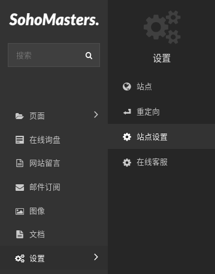
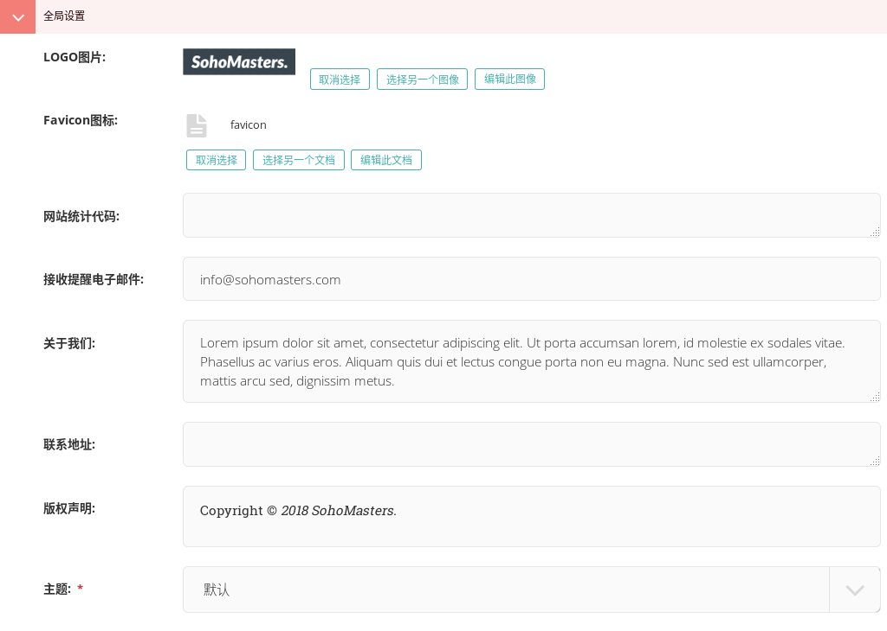
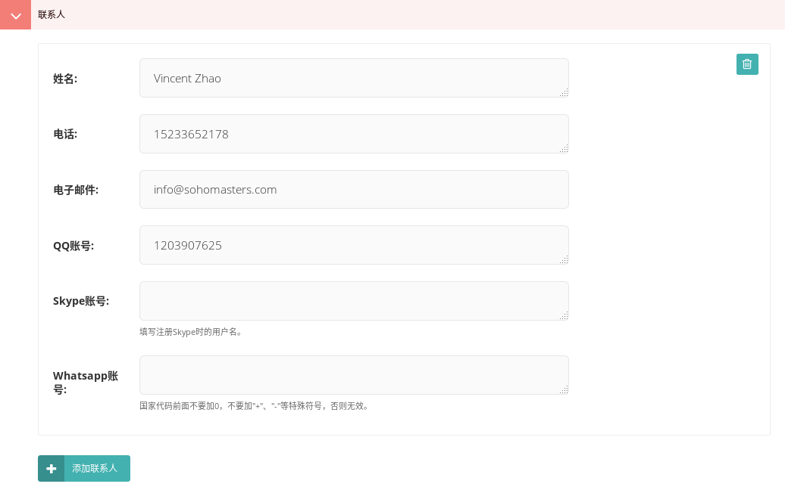
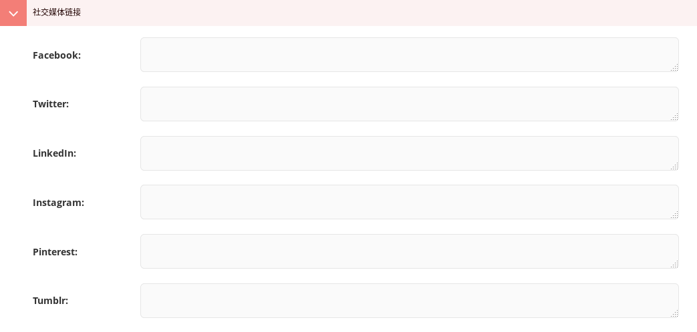

# 站点设置 {docsify-ignore}

> 这一节介绍站点设置。

从菜单中点击“设置”打开子菜单，选择“站点设置”。

## 全局设置

第一项、第二项分别设置网站的LOGO和favicon图标。

网站统计代码，填写谷歌分析或者其他代码统计服务的统计代码，可添加多个。

接受提醒电子邮件，用来接受网站的询盘、留言和邮件订阅提醒。

关于我们、联系地址、版权声明三项内容在网站页脚显示。

最后一项主题，可以通过这里一键修改网站的主题模板。

## 联系人

网站的联系人信息，可以添加多个。

这里的内容将在网站页脚和侧边栏内显示。

## 社交媒体链接

网站的页眉和页脚内显示社交媒体图标，这里可以设置这些图标的链接，有利于社交媒体营销。

