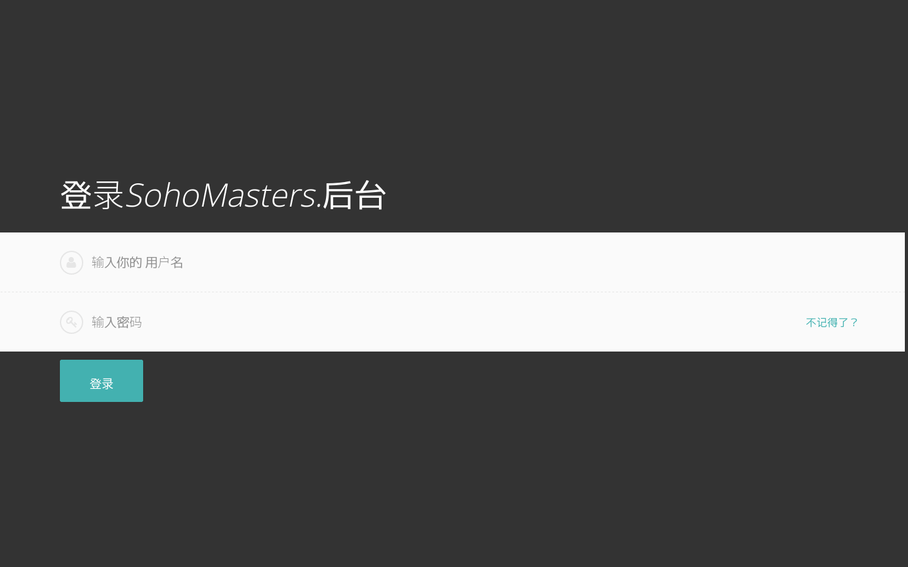
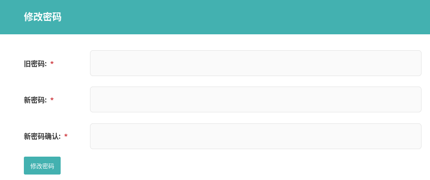

# 基础 {docsify-ignore}

> 这一节介绍如何登录网站后台，忘记密码后如何重置，以及如何修改密码。

## 登录

在浏览器中输入后台登录地址：由于安全原因不公开展示，请联系客服索取。

分别输入用户名、密码，并点击登录按钮即可。初始用户名、密码会以电子邮件的形式发送至客户的邮箱。

## 密码重置

进入登录页面，点击上图中密码输入框右侧的“不记得了？”链接，进入密码重置页面。

输入和用户关联的电子邮件地址，并点击重置密码。

系统会发送一封电子邮件到用户邮箱，打开邮件中的链接，开始密码重置，成功后，重新登录即可。

## 密码修改

在网站后台的左下方，点击用户名，弹出下拉菜单，点击“账号设置”。

进入“账号设置”页面，点击“修改密码”。另外两个按钮暂时可以忽略。

按要求输入密码，并确认修改即可。

