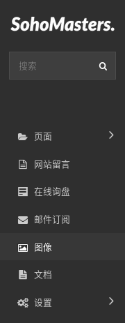
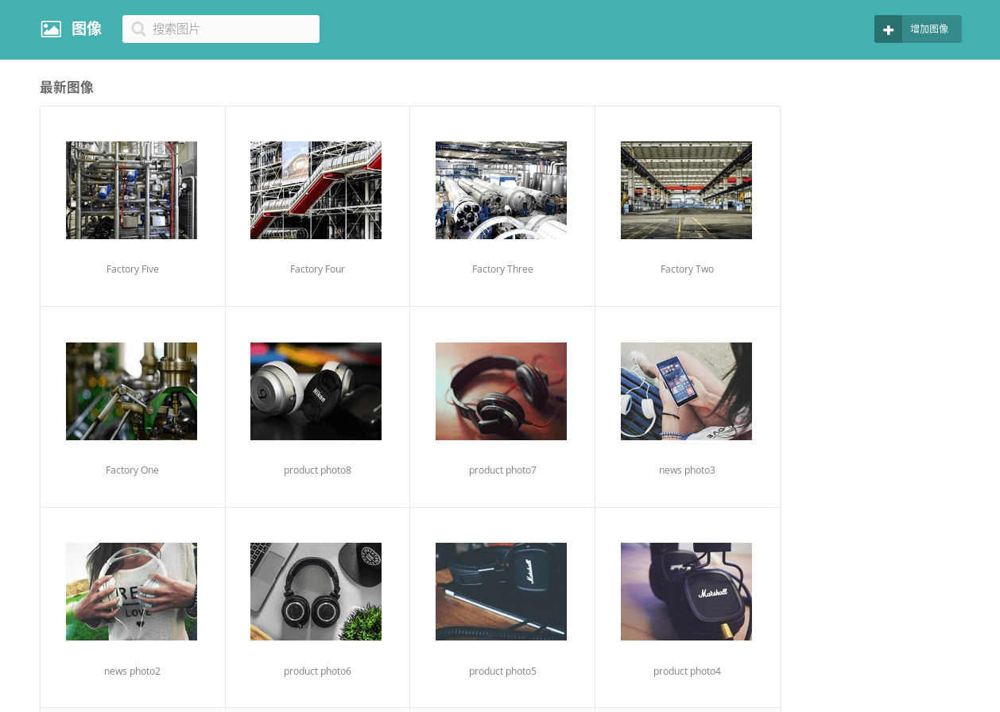
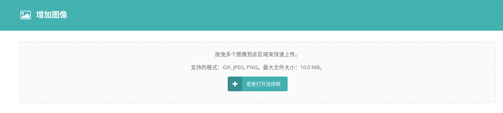
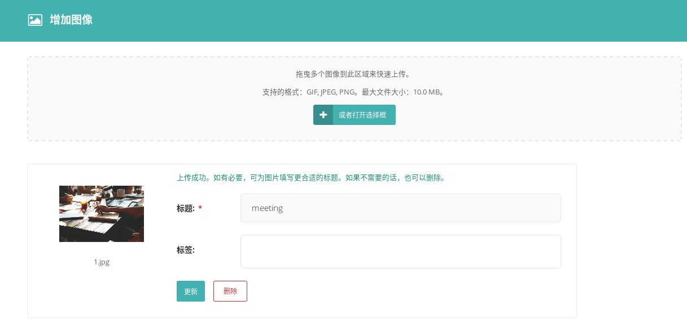

# 媒体管理 {docsify-ignore}

> 这一节介绍图像和文档的管理。

## 图像管理

> 图像管理界面设计十分简介，管理起来非常方便。

在菜单栏点击“图像”打开图像管理界面。

> 查找图像

查找图片有以下三种方式：

* 使用搜索功能查找（推荐）。
* 手动一页一页进行查找（低效）。

> 编辑图像

点击其中一张图像，进入图像设置页面，根据需要对其属性进行修改即可。

图片的标题文字就是图片的alt标签中的文字。

设置图片标签，有利于通过搜索功能找到该图片。

网站前台中出现的图片缩略图比例为1:1，由系统自动生成，如果设置了图片的焦点区域，则生成的缩略图以该焦点为中心，通常情况下没必要设置焦点区域。

点击“增加图像”按钮进行图片上传。

可以打开选择框，或者直接拖拽的方式上传，可同时上传多张图片。

上传成功后，还可以马上设置图片属性，或者选择直接删除图片。

## 文档管理

> 文档管理与图像管理类似，不再赘述。
