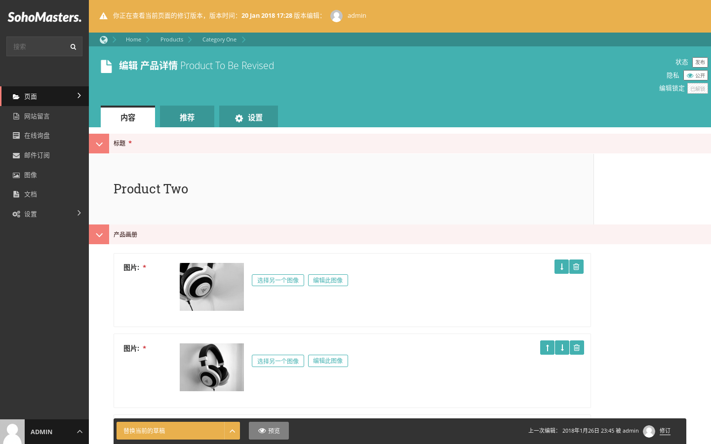

# 页面操作 {docsify-ignore}

> 这一节介绍与页面相关的操作。

## 页面移动

> 本例将演示如何将产品`Product To Move`从产品分类`Category Two`移动到`Category One`。

通过页面浏览菜单，打开产品分类`Category Two`的管理界面，点击`Product To Move`标题下方的“更多”按钮，在弹出的下拉菜单中选择“移动”。

通过点击页面标题右方的箭头，找到产品分类`Category One`，点击其标题进行选择。

确认无误后，点击确认。

提示移动成功。

## 页面复制

> 本例将演示如何将产品`Product To Copy`从产品分类`Category One`复制到当前或者其他分类。

通过页面浏览菜单，打开产品分类`Category One`的管理界面，点击`Product To Copy`标题下方的“更多”按钮，在弹出的下拉菜单中选择“复制”。

修改新的页面的标题、静态网址缩略名，如果需要将新页面移动到其他父页面，可以更改父页面，如果需要新页面保持发布状态，可以勾选最后一项，反之不勾选。

!> 第二项内容为静态网址缩略名，该内容不可重复，必须更改，否则将提示错误。

提示复制成功。

## 页面隐私

> 页面隐私设置默认为公开，即所有人都可以在前台访问，本例将演示如何将页面`private`的隐私设置为私有，必须使用密码才能访问。

打开`private`页面的管理界面，点击页面标题右方的隐私按钮。

弹出页面隐私设置窗口。

选择第三项“私有，使用下列的密码访问：”，设置密码并保存。

页面隐私状态已经从“公开”变成“私有”，设置成功。现在再去前台访问该页面会提示用户输入密码进行访问。

## 页面修订

> 系统自动将页面的每次更新保存为单独的修订版本，可以随时查看、甚至恢复到之前的任何一次修订版本。

在页面的管理界面当中，点击某页面标题下方的“更多”按钮，在弹出的下拉菜单中选择“修订”。

进入页面修订版本列表。

可以将任何一个修订版本与上一个修订版本进行比较。

显示比较结果。

可以查看任何一个修订版本。

进入该修订版本的编辑界面，此时，可以还可以对该修订版本进行编辑修改。

编辑完成后，可以进行三种操作：

* 预览，可以对这个修订版本进行预览，查看其在前台的效果。
* 替换当前的草稿，即将当前修订版本保存为草稿，下次编辑该页面时，将打开当前保存的内容。
* 发布这个版本，即将当前修订版本发布出去，前台访问该页面时，其内容即为该修订版本内容。

!> 进行后两个操作时，由于是旧的版本内容，可能会存在必填项为空、静态网址缩略名冲突的问题，操作时需要注意，将错误项更正即可。

