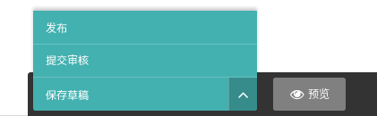

## 添加页面 {docsify-ignore}

> 网站上线时，系统内已经建好了完整的页面结构。通常情况下，只需修改一下页面的文字和图片，再调整一下产品和产品分类即可。当需要添加新的产品分类、产品详情、新闻文章、自定义页面时，再进行添加。

!> 前面的说明中出现过的内容，后面不再重复叙述。

## 产品分类

通过页面浏览菜单，找到产品主页，点击标题products进入产品主页管理界面。

在products标题下方，点击“添加子页面”。

选择并点击要创建的页面类型“产品分类”。

在“内容”标签下的“标题”处输入产品分类名称。

!> “标题旁边”的红色星号表示，该项目属于必填项，如果不填写任何内容，提交时会提示错误。

在“推荐”标签下，分别进行SEO设置和菜单设置。

> 设置静态网址

缩略名填写的内容是该页面的网址的最后部分，页面的网址由以下规则决定：假如网站的网址是`www.example.com`，也就是打开首页的网址，那么将首页的子页面产品主页的缩略名设置为`products`，则产品主页的网址就是`www.example.com/products/`，而将产品主页的子页面某产品分类的缩略名设置为`category one`，则该产品分类的网址就是`www.example.com/products/category-one/`，以此类推。

页面标题、搜索描述、搜索关键词分别对应网页的`title`、`description`、`keywords`标签，页面标题如果不填写，`title`标签内容默认使用“内容”标签下的“标题”。

> 设置导航菜单

网站前台的导航菜单自动生成，不需要逐个添加。假如某个页面链接需要出现在导航菜单中，只需要在“菜单项设置”中，勾选第一项即可，菜单名称默认使用“内容”标签下的“标题”，也可以通过设置第二项“显示名称”显示其它文字。该项设置对首页无效，首页的子页面将显示在导航菜单中的第一级，子页面的子页面为第二级，以此类推，以多级下拉菜单的形式呈现。

在“设置”标签下，可以设置页面定时发布和过期时间。

内容添加完成后，可以对未发布的网页进行预览、保存为草稿、提交审核、发布四种操作。

* 预览功能方便在最终发布之前，确认内容是否需要进一步修改。
* 保存草稿功能，方便用户将当前编辑的内容保存为草稿，留到下次继续编辑。
* 提交审核功能通常情况下不会用到，可以直接忽略该功能。
* 发布功能将当前添加或者编辑的页面公开，使用户能够在网站前台访问该页面。

发布后，该产品分类页面即添加成功。

## 产品详情

> 添加产品画册

多次点击“添加产品画册”按钮，可添加多张图片，点击“选择一个图像”，弹出图片浏览窗口，用户既可以从系统已有的图片中选择图片进行添加，也可以通过上传图片进行添加。

添加完图片之后，可以点击“选择另一张图片”更换，或者点击“编辑此图像”直接修改图片。

点击图片右方的上下箭头，可以修改图片的显示顺序，点击删除按钮，可以将其删除。

在图片浏览窗口中可以在搜索条件中输入关键词来快速找到图片。

上传图片时，必须填写标题，也就是图片的alt标签，有利于SEO。添加标签有利于通过搜索功能快速找到图片。

> 添加产品参数

和添加图片类似，点击添加按钮可以添加多个参数，还可以排序及删除。

!> 如果点击了添加产品参数，但是内容留空，在提交时会提示出错，这时，把留空的产品参数删掉即可。

> 添加图文描述

图文描述采用独创的“流式内容编辑器”，可无限添加内置内容模块，包括所见即所得编辑器模块，并任意排序组合。

所有内容模块均有设计好的前台样式，在添加完所有内容后，可点击预览进行查看，并决定是否进一步修改及调整。

利用所见即所得编辑器，可以自由添加文字、图片、链接、嵌入视频、文档下载链接等内容，还可对内容进行排版。

点击模块下方或者上方的加号图标，可以继续从相应位置添加内容模块。

在模块右方，可以查看该模块的名称，并可以进行排序调整或者删除操作。

> 使用所见即所得编辑器添加图片

在所见即所得编辑器内，点击图片图标，打开图片浏览窗口，选择或上传图片，最后选择排版样式，插入图像即可。

选择左对齐或右对齐时，图片宽度最多不超过所在内容宽度的50%，分别向左或右对齐。选择完整宽度时，图片宽度最多等于所在内容宽度，且居中对齐。

> 添加表格

表格模块采用类Excel组件，可以自由添加行、列，并支持设置第一行或者第一列为表头，适合创建各类表格。

> 添加产品标签

输入将要添加的标签，然后按回车键或者英文逗号键进行添加。产品标签有利于用户在网站前台通过搜索功能将其搜索出来。

> 添加相关产品

和添加图片画册类似，不再赘述。

点击“选择相关产品之后”，弹出页面选择窗口，这里只能选择“产品详情”页面，通过搜索功能，或者通过点击产品分类右方的箭头手动查找，然后点击目标页面的标题进行选择即可。

在产品详情页面添加相关产品，一方面使网站内页互联，另一方面，有利于降低网页的跳出率，对SEO有帮助。

> 推广至首页

在“推荐”标签下，可以勾选“推广至首页”，则产品即在首页的“产品橱窗”中显示。

首页的“产品橱窗”一共可以显示8个产品，按照发布时间倒序，即最新发布的显示在前面。如果有超过8个的产品被推广到了首页，只有最新发布的8个产品可以在首页显示。

## 新闻文章

> 添加文章摘要

新闻摘要为必填项，将以摘要的形式在新闻列表中显示。

## 自定义页面

> 前面的说明已经覆盖到了，不再赘述。
