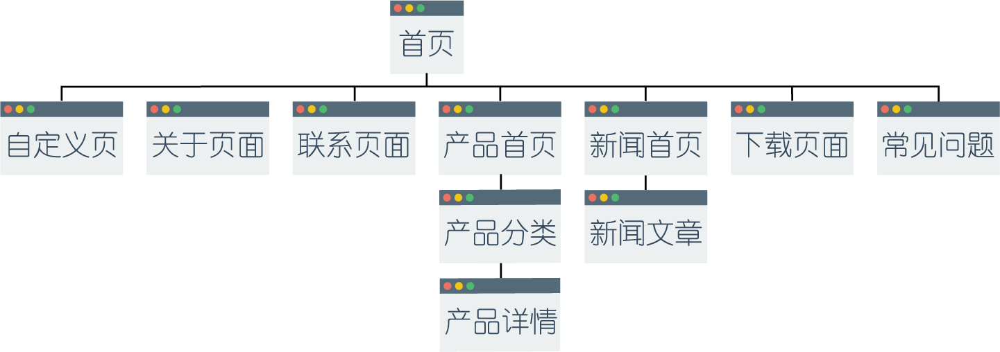

# 页面类型 {docsify-ignore}

> 这一节介绍网站中的页面类型。

网站页面呈现以下层次结构，其中首页处于最顶层，这种层次在前台和后台都有体现。

## 首页

> 该页面只有一个，不能新建，只能编辑。

##### 该类型的子页面类型

* 产品首页
* 新闻首页
* 下载页面
* 常见问题
* 联系页面
* 自定义

## 产品首页

> 该页面只有一个，不能新建，只能编辑。

##### 该类型的子页面类型

* 产品详情

## 产品分类

> 该页面数量没有限制，可以创建多个。

##### 该类型的子页面类型

* 产品分类
* 产品详情

## 产品详情

> 该页面数量没有限制，可以创建多个。

##### 该类型没有子页面类型

## 新闻首页

> 该页面只有一个，不能新建，只能编辑。

##### 该类型的子页面类型

* 新闻文章

## 新闻详情

> 该页面数量没有限制，可以创建多个。

##### 该类型没有子页面类型

## 下载页面

> 该页面只有一个，不能新建，只能编辑。

##### 该类型没有子页面类型

## 常见问题

> 该页面只有一个，不能新建，只能编辑。

##### 该类型没有子页面类型

## 联系页面

> 该页面只有一个，不能新建，只能编辑。

##### 该类型没有子页面类型

## 自定义

> 该页面数量没有限制，可以创建多个。

##### 该类型没有子页面类型

关于页面属于自定义页面类型。
