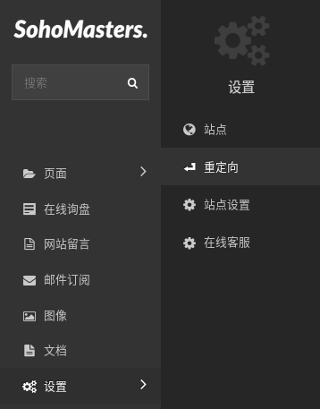
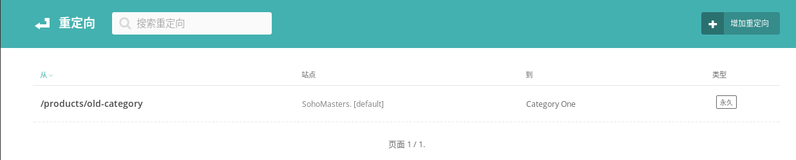
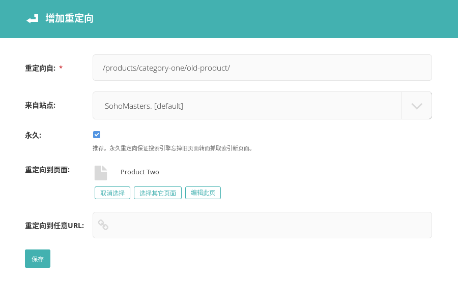

# 重定向 {docsify-ignore}

> 这一节介绍重定向。

在网站运营过程中，经常会出现一种情况，就是某一个页面的静态网址改变了，或者旧页面被删除了，但是由于搜索引擎收录了该页面，于是，用户通过搜索引擎点击进来之后就出现了找不到页面的情况。

通过添加重定向，可以将页面的旧网址转向到新的网址，由此解决了上述问题。

如果使用了永久重定向（推荐），则可保证搜索引擎忘掉旧页面转而抓取新页面。

## 添加重定向

从菜单中点击“设置”打开子菜单，选择“重定向”。

进入重定向列表页面，点击标题右方的添加按钮添加重定向。

第一项填写需要重定向的完整的静态网址，比如网址是`https://www.example.com/this-is/the-old/page/`，则此处填写`/this-is/the-old/page/`。
第二项选择默认[default]，第三项勾选，第四项选择需要转向到的目标页面，或者直接在第五项填写任意网址。

保存即可完成。
