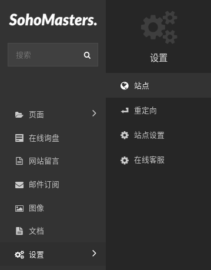
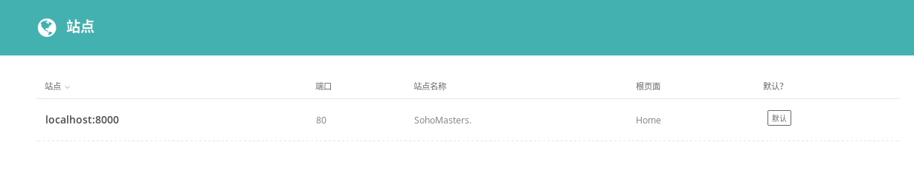
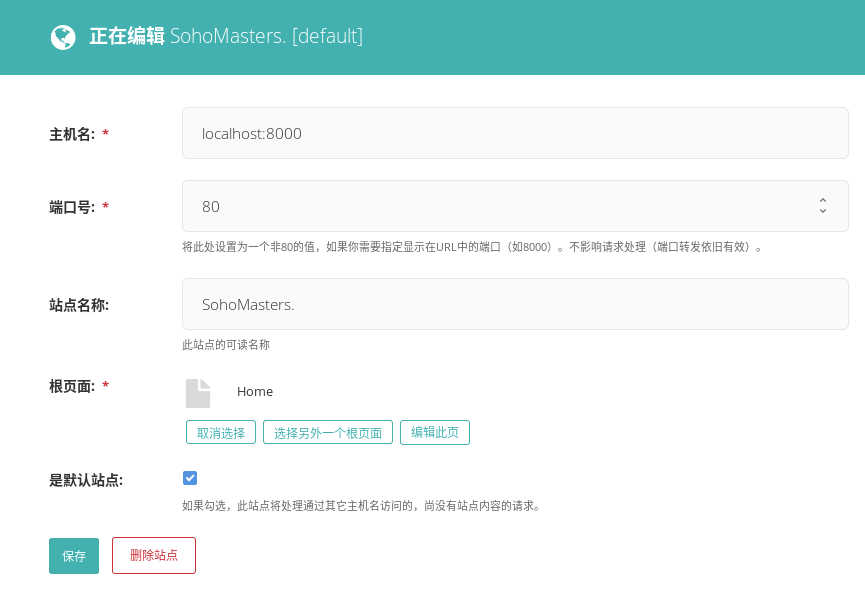

# 站点 {docsify-ignore}

> 这一节介绍站点。

## 修改站点名称

从菜单中点击“设置”打开子菜单，选择“站点”。

进入站点列表页面，点击站点标题进入站点编辑页面。

!> 其他设置项不要修改，只修改“站点名称”。

如果设置了“站点名称”，其内容将以后缀的形式出现在网页标题中。比如，某网页标题为“Contact Us”，“站点名称”设置为“SohoMasters.”，则该网页标题为“Contact Us - SohoMasters.”。

修改完成后保存即可。
