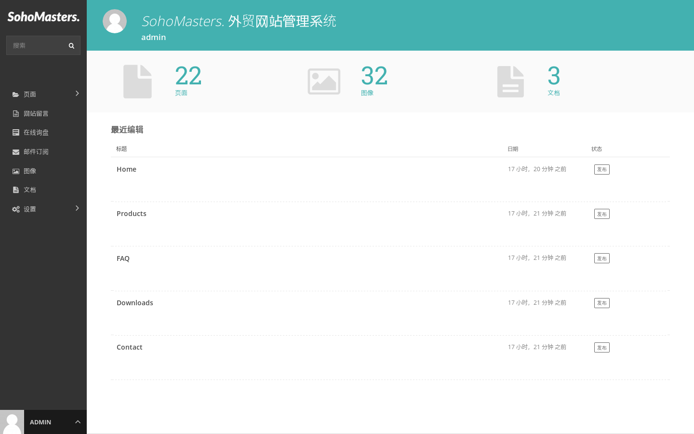

# 界面 {docsify-ignore}

> 这一节帮助用户了解和熟悉网站后台的界面。

## 控制面板

登录之后，进入后台首页，即控制面板。

控制面板主要显示以下信息：

* 系统内已有页面、图片和文档的数量信息。
* 最近编辑过的页面。

## 导航菜单

* 点击菜单中的“页面”打开页面导航菜单，通过它可以查找网站中的所有页面。
* 点击菜单中的页面名称，进入该页面的管理页面。
* 点击菜单中的页面名称右方的编辑图标，进入该页面的编辑页面。
* 点击菜单中的页面名称右方的小箭头，进入该页面的子页面菜单。
* 点击菜单中顶部的标题，返回之前的位置。

## 搜索

* 通过左上角的搜索框，使用关键词对内容进行快速搜索，结果以分类列表显示。
* 随着关键词的输入，内容结果跟随同步更新。
* 点击结果列表中的标题，进入相关内容的编辑页面。

## 页面管理

* 通过点击页面浏览菜单中的页面标题，进入页面管理界面。
* 页面管理界面允许用户对该页面及其子页面进行管理操作，比如“添加子页面”，以及对该页面及其子页面进行“发布”、“取消发布”、“移动复制”、“删除”等操作。
* 子页面右方有箭头的，表示该子页面本身也有子页面，点击箭头进入该子页面的页面管理界面，以此类推。

## 页面排序

* 点击“标题”左侧的排序图标，点住子页面标题左侧出现的拖拽图标（六个小点），拖拽排序即可，拖拽操作完成后，顺序自动保存。
* 这里的排序，即页面在前台导航菜单中的顺序。

